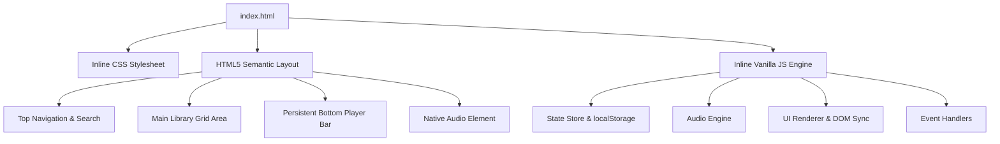
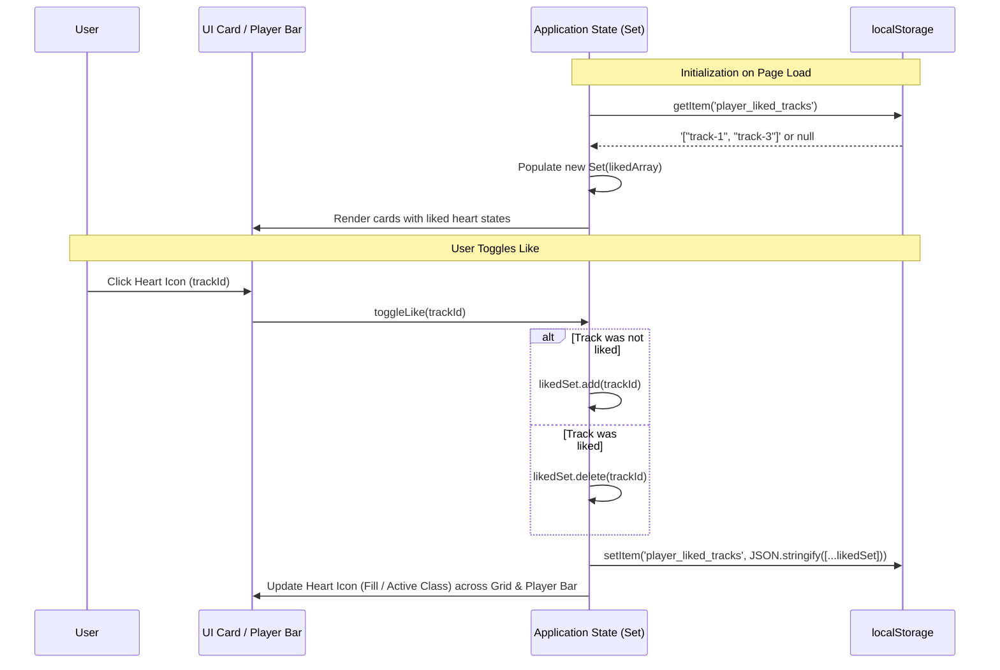

# Technical Design Specification: Single-Page Music Player

This document defines the structural architecture, data schemas, and state management mechanisms for the single-page music player application in accordance with [AGENTS.md](file:///c:/Users/Dhruva%20Shah/Desktop/Spotify/AGENTS.md) and [spec/requirements.md](file:///c:/Users/Dhruva%20Shah/Desktop/Spotify/spec/requirements.md).

---

## 1. High-Level Architecture

The entire application is self-contained within a single `index.html` file with zero external dependencies, libraries, or build steps:
- **Presentation**: Inline `<style>` block containing CSS design tokens, modern dark-theme aesthetics, responsive grid layouts, and micro-animations.
- **Markup**: Clean HTML5 semantic layout dividing the UI into a Header/Search area, Library Grid, and Bottom Player Bar.
- **Logic**: Inline `<script>` block organized into cohesive vanilla JavaScript modules (State, AudioEngine, UI Renderer, Event Controller).



---

## 2. Structure of `index.html`

### 2.1 DOM Layout Hierarchy

The DOM is partitioned into three primary regions and a hidden audio engine:

1. **Top Header & Search Bar (`<header class="app-header">`)**:
   - Application logo and title with inline SVG icon.
   - Search input container with real-time text filter and clear button.
   - Library track count summary.

2. **Main Content Container (`<main class="main-content">`)**:
   - Section header (e.g., "All Tracks", search result indicator).
   - Responsive Track Grid (`<div id="track-grid" class="track-grid">`):
     - Track Cards containing cover artwork, play overlay button, track title, artist, duration, and like button.
   - Empty search results placeholder container (`<div id="empty-state">`).

3. **Persistent Player Bar (`<footer class="player-bar">`)**:
   - **Left Section (Active Track Info)**:
     - Album thumbnail artwork.
     - Title and artist text marquee/ellipsis.
     - Active track Like (heart) toggle button.
   - **Center Section (Playback & Timeline Controls)**:
     - Control buttons: Previous, Play/Pause toggle, Next.
     - Timeline scrub bar: Current timestamp (`#current-time`), interactive range/progress slider (`#seek-slider`), and total duration (`#total-duration`).
   - **Right Section (Volume & Utilities)**:
     - Mute/Volume icon toggle.
     - Interactive volume slider (`#volume-slider`).

4. **Audio Engine Element**:
   - Native `<audio id="audio-player" preload="metadata"></audio>`.

### 2.2 Inline Styling Strategy (`<style>`)

- **Design System Tokens (`:root`)**:
  - Color palette: Deep dark backgrounds (`#121212`, `#181818`, `#282828`), Spotify green accent (`#1db954`, hover `#1ed760`), muted text (`#b3b3b3`), white primary text (`#ffffff`), border glass accents (`rgba(255, 255, 255, 0.1)`).
  - Typography: System sans-serif fallbacks (`-apple-system, BlinkMacSystemFont, "Segoe UI", Roboto, Helvetica, Arial, sans-serif`).
  - Spacing, border radii (cards: `8px`, buttons: `500px`), and elevation box-shadows.
- **Layout Model**:
  - CSS Grid with `grid-template-columns: repeat(auto-fill, minmax(180px, 1fr))` for fluid responsive track cards.
  - Fixed-bottom flexbox container for the player bar with `z-index: 100`.
- **Micro-Interactions**:
  - Card hover scale and play button reveal transitions.
  - Custom styled input range sliders (`::-webkit-slider-thumb`, `::-moz-range-thumb`) matching the Spotify progress bar experience.

### 2.3 Inline JavaScript Modular Architecture (`<script>`)

The JavaScript engine is organized into structured namespaces within an IIFE to prevent global namespace pollution:

- `Catalog`: Static track data array loaded from `TRACKS.md`.
- `Storage`: Read/write abstractions for `localStorage` serialization.
- `State`: Reactive central application state object (active track index, playback status, search query, liked track set, volume).
- `AudioEngine`: Wraps HTML5 `<audio>` element, handles play/pause, seeking, time updates, track switching, and autoplay progression.
- `UIRenderer`: Generates HTML for track cards, updates active playing indicators, syncs player bar info, and toggles like icons.
- `EventHandlers`: Binds click, input, keyboard, and audio lifecycle events.

---

## 3. Shape of the Track Array

The catalog data is defined as a typed, immutable array of track objects hardcoded from `TRACKS.md`.

### 3.1 Track Object Schema

```typescript
interface Track {
  id: string;             // Unique identifier (e.g., "track-1")
  title: string;          // Song title
  artist: string;         // Artist / Performer name
  album: string;          // Album title
  duration: number;       // Duration in seconds (e.g., 215)
  durationFormatted: string; // Formatted duration string (e.g., "3:35")
  coverUrl: string;       // URL or data URI for the album artwork
  audioUrl: string;       // Direct audio stream / file URL
}
```

### 3.2 Data Structure Representation

```javascript
const TRACKS = [
  {
    id: "track-1",
    title: "Track Title",
    artist: "Artist Name",
    album: "Album Name",
    duration: 180,
    durationFormatted: "3:00",
    coverUrl: "assets/cover1.jpg",
    audioUrl: "assets/audio1.mp3"
  }
  // Additional tracks populated from TRACKS.md
];
```

---

## 4. State Persistence & Liked State Management

All user preferences and playback states are persisted in `localStorage` under specific, collision-free keys.

### 4.1 Storage Keys

| Key | Type | Description |
| :--- | :--- | :--- |
| `player_liked_tracks` | `string` (JSON Array) | Array of liked track ID strings, e.g. `["track-1", "track-4"]` |
| `player_active_track_id` | `string` | ID of the last active or playing track |
| `player_playback_time` | `number` | Last saved playback timestamp in seconds |
| `player_volume_level` | `number` | Last active volume level (between `0.0` and `1.0`) |

### 4.2 Liked State Storage and Restoration Workflow

#### Liked State Data Lifecycle



#### Restoration & Synchronization Rules:
1. **In-Memory Set**: Runtime liked status is tracked using a `Set<string>` for $O(1)$ membership checks during grid rendering and heart toggles.
2. **Instant Sync**: When a track is liked/unliked from either the library card or the player bar, both UI representations are synchronized immediately without requiring full DOM re-renders.
3. **Safe Fallback**: If `localStorage` is empty or corrupted, the system initializes with an empty `Set` without throwing uncaught exceptions.

---

## 5. Playback Flow & Auto-Play Strategy

1. **Auto-Play Progression**:
   - The native `ended` event on the `<audio>` element triggers the `playNext()` routine.
   - The active track index increments by 1.
   - If the index exceeds `TRACKS.length - 1`, it resets to `0` (continuous circular queue).
2. **Autoplay Policy Handling**:
   - On initial page load with restored state, the audio element is cued to the saved track and time position in a paused state.
   - Direct user action (clicking a card, pressing play) initiates active playback to comply with browser audio autoplay constraints.
